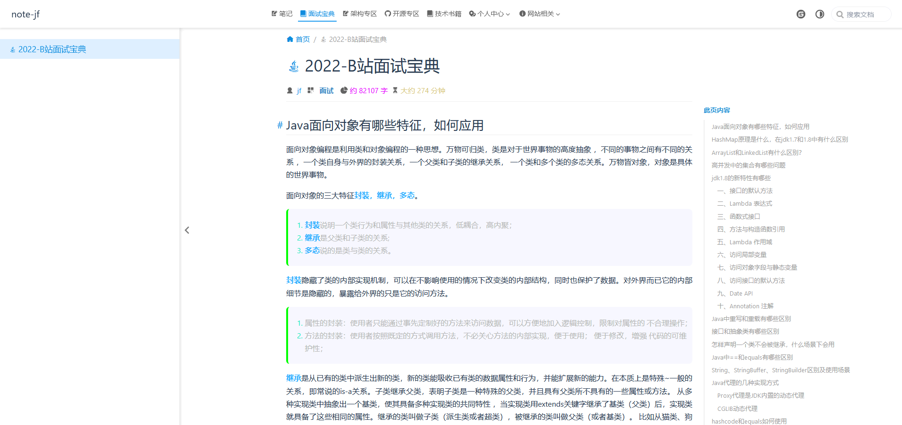

## topsjf

- [🚀🚀预览🚀🚀](https://topsjf.github.io/)
- [github](https://github.com/topsjf/topsjf)
- [gitee](https://gitee.com/topsjf/topsjf)
- vuepress-theme-hope：[文档](https://vuepress-theme-hope.github.io/v2/zh/)、[github](https://github.com/vuepress-theme-hope/vuepress-theme-hope)
- [使用Java压缩md文件中使用到的图片](https://gitee.com/cps007/imgfileserve)
- [参考 Mister-Hope.github.io](https://github.com/Mister-Hope/Mister-Hope.github.io)

--------

- [releases](https://github.com/topsjf/topsjf/releases)

-------

[](https://stackblitz.com/github/topsjf/topsjf)

-------

## 提交规范

git add -A

**命令提交**：pnpm run commit || git commit -m "选项: 描述"

**web端提交** 简单描述格式：选项: 简要描述

<<<<<<< HEAD
可选项如下：

- feat: 新的功能
- fix: 修复buf
=======
*可选项如下*：
- break change feature 发布会增加主版本号（如1.1.1 –> 2.0.0）
- feat: 新的功能，发布版本会增加次版本号（如1.0.0 –> 1.1.0）
- fix: 修复bug，发布版本会增加修订版本号（如 1.0.0 –> 1.0.1）
>>>>>>> 1c4a7bdee6d644d2bed9a2365d8ca42fef679474
- docs: 只修改文档
- style: 不影响代码含义的修改（比如：空格、格式化、添加缺少的分号等）
- refactor: 重构代码（既不修复错误，也不增加功能）
- perf: 性能优化
- test: 添加测试或纠正现有测试
- build: 影响构建系统或外部依赖的变化（如glup、npm等）
- ci: ci配置文件和脚本的改变 （如：Travis、Circle）
- chore: 其它不修改src或测试文件的改动
- revert: 回滚之前的提交

<<<<<<< HEAD
- **fix** 发布会增加修订版本号（如 1.0.0 –> 1.0.1）
- **feat** 发布会增加次版本号（如1.0.0 –> 1.1.0）
- break change feature 发布会增加主版本号（如1.1.1 –> 2.0.0）
=======
>>>>>>> 1c4a7bdee6d644d2bed9a2365d8ca42fef679474

## 添加新文件步骤

1、创建文件 `./docs/java/demo.md`

2、添加侧边栏路由 `.vuepress/sidebars/{index.ts,java.ts}`

```json
{
  text: "Java",
  icon: "java",
  prefix: "java/",
  collapsable: true,
  children: [
    "demo",
  ]
}
```

自动读取md文件并配置侧边栏目录

> children: "structure",


## md文件设置frontmatter

```text
#顶置，你可以将sticky设置为number来设置它们的顺序。数值大的文章会排列在前面。
sticky: true
#收藏
star: true
#是否是文章，或者 plugins.blog.filter 自定义哪些页面是文章。
article: false
#是否显示在时间线
timeline: false
```

## 效果预览




## 技术选型

- 设置淘宝源

配置查看：npm config list

```shell
npm config set registry https://registry.npm.taobao.org
```

- 安装Pnpm：

```shell
corepack enable
corepack prepare pnpm@7.17.0 --activate
```
卸载：

```shell
corepack disable pnpm
```

- 创建初始化项目： 


```shell
pnpm create vuepress-theme-hope@next docs
```

```shell
npm init vuepress-theme-hope@next docs

```

> docs这里的 docs 是一个参数，代表 VuePress 项目的文件夹名称，在本教程中，我们将 VuePress 项目生成至项目文件夹下的 `docs`子文件夹。如果你有需求，你可以更改此参数来使用一个新文件夹，或使用 `.` 直接使用当前的文件夹。

- 技术版本列表

| 技术                      | 地址                                                                                                |
|-------------------------|---------------------------------------------------------------------------------------------------|
| node                    | <a href="https://www.npmjs.com/package/node" target="_blank">16.x</a>                          |
| npm                     | <a href="https://www.npmjs.com/package/npm" target="_blank">8.x</a>                            |
| pnpm                    | <a href="https://www.npmjs.com/package/pnpm" target="_blank">7.x</a>                           |
| vue                     | <a href="https://www.npmjs.com/package/vue" target="_blank">🚀🚀</a>                           |
| vuepress-theme-hope     | <a href="https://www.npmjs.com/package/vuepress-theme-hope" target="_blank">🚀🚀</a>           |
| vuepress                | <a href="https://www.npmjs.com/package/vuepress" target="_blank">🚀🚀</a>                      |
