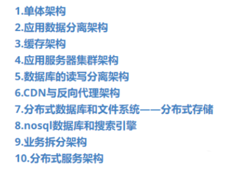
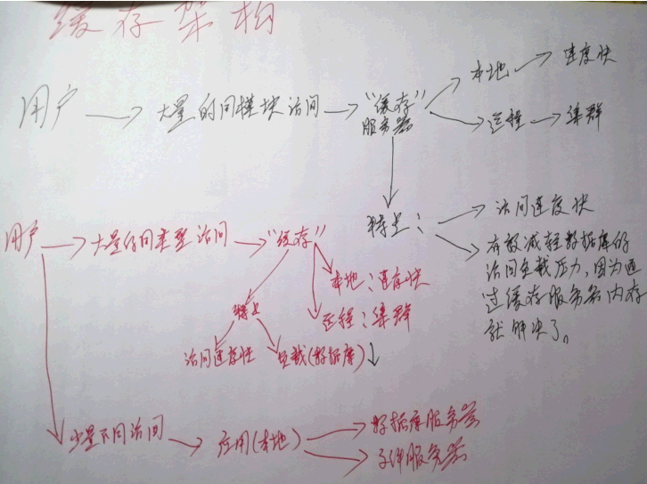
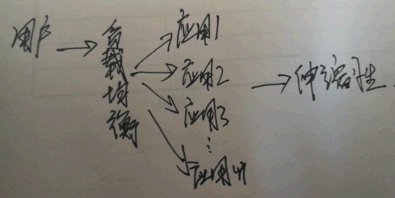
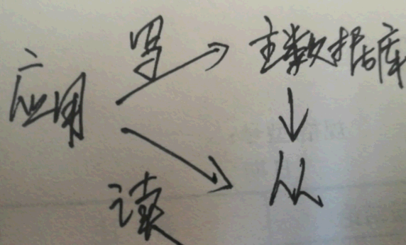
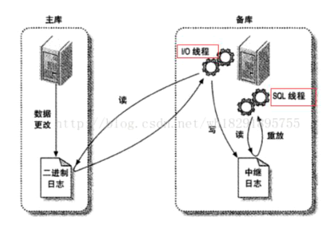
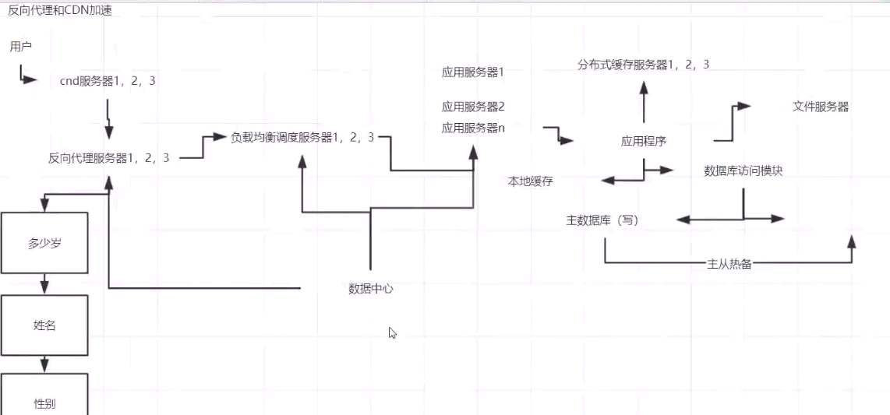
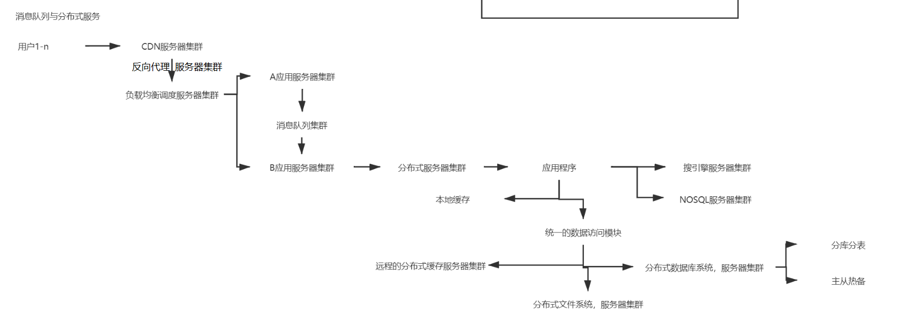
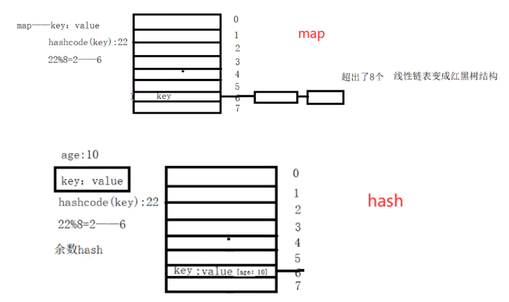
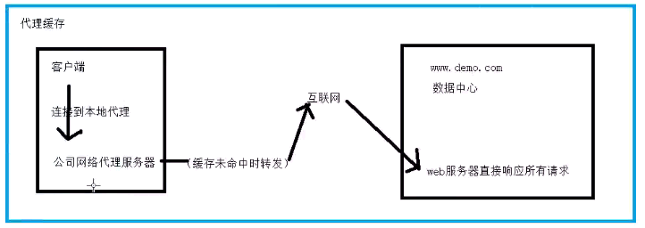
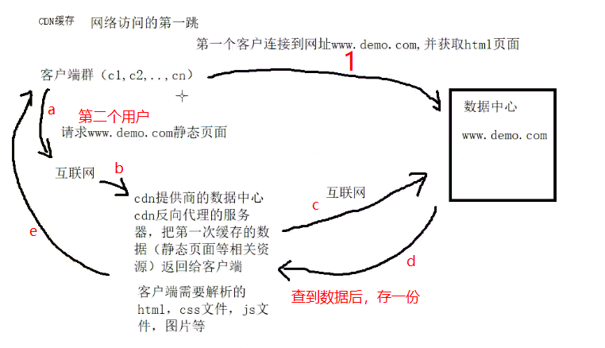

项目架构演变 > 分布式：缓存-消息队列-数据库

<!-- more -->

## 一、大型项目的架构演化



### 1、单体架构

首先。在软件项目开发的最开始，就是很久很久以前，应用软件的访问量很小，大家访问的网站并不需要很复杂的业务逻辑，因此采用的是一台服务器搞定所有需求：：：：叫小型网站时代

网站使用的操作系统是linux，服务器是nginx，编程语言是php，数据库是mysql这种开源免费数据库
如图：


-----------------

----------------

### 2、应用数据分离架构

在发展的过程中，由于访问量的增加，出现了一台服务器的并发性能瓶颈，存储空间也面临挑战。

于是，第二阶段的架构模型就出现了，叫做应用数据分离架构
以前的一台服务器，包含所有内容的结构，现在变成需要三台服务协作完成，分别是应用服务器（计算能力更强的CPU），数据库服务器（更快的检索速度），文件服务器（大硬盘容量），用户访问应用服务器，应用服务器访问数据库与文件服务器
如图：


> 这种架构解决了部分问题，但是缺陷也面临出来，随着用户数量的增加，数据库的检索压力越来越大，比如一个用户访问到应用服务器，应用服务器再对数据库服务器进行IO操作，频繁的大量的IO操作让数据库面临新的性能瓶颈.
>
> 于是，为了解决数据库的性能瓶颈，出现了三阶段的架构，缓存架构.

### 3、缓存架构



> 实际应用场景是大部分的访问内容都集中在一小部分的数据上，例如打开首页，大家都要打开，就把这个数据放在一个缓存服务器上，缓存的结构是将数据放入服务器的内存中，而不是服务器的硬盘上，因此哦用户的访问请求一旦到达缓存服务器，缓存结构就从内存中将数据返回回来，并不需要在走一道应用服务器和数据库服务器.
>
> 由于缓存架构是在缓存服务器上实现的，在这个阶段实际上是将应用服务器与缓存服务器兼并在一台服务器上使用.
> 那么缓存数据就存在于本地应用服务器上.
> 同时，还开发出了一种技术，专门用于处理缓存服务器上的（远程缓存）.
> 也就是说，缓存在这个阶段，有两种实现，本地应用服务器缓存与缓存服务器上的远程缓存.
>
> 本地缓存：特点是访问速度更快，缺点是应用服务器的内存限制，1——缓存的数据量有限；2——会和本地应用争抢内存.
> 远程缓存：通过一个缓存服务器集群实现，并非是通过一台大内存的缓存服务器来实现，由于是多台缓存服务器联合结合使用，理论上是不受内存容量限制的.
>
> 增加缓存结构后，由于从本地和集群中调取内存中的缓存数据，所以访问数据的速度更快，同时由于不再需要从数据库中访问这大量访问集中的这小部分数据，因此极大地缓解了数据库的访问负载压力.
> 不过这种架构也面临缺陷：面对持续增高的请求量，单一应用服务器的处理能力是有限的，在访问高峰期，这就是网站的性能瓶颈.
>
> 缺陷：面对持续增高的请求量，单一应用服务器的处理能力是有限的，在访问高峰期，这就是网站的性能瓶颈.这里的缺陷大家要注意，对象不再是数据库了，而是应用服务器.

-------------------------------------------------------------------------------------------------------------------

--------------------------------------------------------------------------------------------------

### 4、应用服务器

​		所谓应用服务器，比如你请求的是百度上的搜索功能，显示对应页面，接受数据请求，进行逻辑运算与结构调用，访问数据库与文件，返回数据给用户的服务器，叫做应用服务器.这里就是指的这种服务器在面对高并发和大数据量的访问的时候出现的性能瓶颈，就是处理不过来了.

于是进入下一个架构模型，应用服务器集群架构:
		通过增加新应用服务器，分担负载请求，改善服务器的压力，通过不断地改变服务器的数量来改变服务器的处理能力，实现系统的可伸缩性。技术上，是将用户请求使用负载均衡的技术，将访问接到某一台应用服务器上，当更多的访问来临时，只需要增加应用服务器的个数，就能提升访问的性能瓶颈:



> ​	这种架构也有一定的问题，虽然大部分访问都可以进入缓存，剩下的也能通过负载均衡技术均衡地访问到不同的应用服务器上（这里的不同服务器单纯是服务器的不同，应用的功能都是相同的），但是随着访问的急剧增加，那些剩下来的小部分访问量的数据依然是一个天文数字，那么这些穿透了缓存服务器的访问，再通过不同的相同功能的应用服务器，最终都将对数据库服务器进行IO操作，这个时候数据库又出现了IO开销的性能瓶颈，也就是处理不过来这样的数据并发和存储数量了,这个时候就出现了 ----数据库的读写分离架构

--------------------------------------------------

---------------------------------

### 5、数据库的读写分离架构



```
	从应用服务器发出的写请求会首先在主数据库中执行，然后主数据库会利用主从热备功能将数据同步到从数据库中；而应用服务器在读数据库的时候会访问从数据库，实现数据库的读写分离，改善数据的负载压力.
数据库主从热备注释：
	保持两个数据库的状态自动同步。对任何一个数据库的操作都自动应用到另外一个数据库，始终保持两个数据库中的		数据一致。
好处： 
1. 可以做灾备，其中一个坏了可以切换到另一个。
2. 可以做负载均衡，可以将请求分摊到其中任何一台上，提高网站吞吐量。 对于异地热备，尤其适合灾备。

简单的说就是把 一个服务器上执行过的sql语句在别的服务器上也重复执行一遍， 这样只要两个数据库的初态是一样的，那么它们就能一直同步.
```



```
	解释：上图中有两个服务器，演示了从一个主服务器(master)把数据同步到从服务器(slave)的过程。 对于一个mysql服务器，一般有两个线程来负责复制和被复制。当开启复制这个开关之后(start slave) 1. 作为主服务器Master，会把自己的每一次改动都记录到 二进制日志 Binarylog 中。 (从服务器会负责来读取这个log，然后在自己那里再执行一遍。) 2. 作为从服务器Slave，会用master上的账号登陆到master上，去读取master的Binarylog, 然后写入到自己的中继日志Relaylog，然后自己的sql线程会负责读取这个中继日志，并执行一遍。到这里主服务器上的更改就同步到从服务器上了。 在mysql上可以查看当前服务器的主，从状态。 其实就是当前服务器的 Binary(作为主服务器角色)状态和位置。以及其RelayLog(作为从服务器)的复制进度.
--------------------------------------------------------------------
	简单的说就是把 一个服务器上执行过的sql语句在别的服务器上也重复执行一遍， 这样只要两个数据库的初态是一样的，那么它们就能一直同步。

缺陷：随着用户使用软件场景的范围越来越广，网络环境越来越复杂，不同的地区用户访问软件的速度差别极大，改善网络速度将采用反向代理与CDN加速:
```

----------------------------

-----------------

### 6 、CDN与反向代理架构

```
基本原理是使用缓存，加快访问网站速度。
CDN部署在网络提供商的机房，从对应用户最近的机房获取数据
反向代理部署在网站机房，缓存服务器响应的结果数据

两种都是缓存机制

特点：两种缓存架构都能显著地提高访问速度，并且由于用户高频率访问通过缓存机制实现了负载均衡，减轻了应用服务器的压力
```


```
	这个是针对网络反应速度的，先是用最近的机房发现访问的是哪一个网站，然后是通过网站中的反向代理将缓存服务器中的响应迅速返回给用户，这些操作都是便于不同地区的不同网络质量的现实业务需求.
--------------------------------------------------------------------
缺陷：随着数量的再次显著提升，任何单一的服务器都不能够满足这样的数据量存储需求
```

--------------------------

------------------------

### 7 、分布式数据库和分布式文件系统架构

```text
	所谓分布式，就是多个服务器，同时协助办公，我们可以这样理解，一个工厂，一个产品的生产需要多个工艺环节，对于大量的产品生产需要不同工艺都有大量的功能相同的工人，这些功能和操作相同的同一个环节的工人他们相互协作，将一个环节协同处理完成。

分布式：多个服务器功能组合完成以前的一个服务器功能。
	在数据库读写分离拆成主从服务器后，数据库随着业务发展，再次不能满足访问压力，存储的数据量太大，单个数据库无法承受。   解决方案是：分布式数据库+分布式文件系统。

分布式数据库：一般是网站数据库拆分的最后手段，对网站工程师的技术要求很高，网站也很难达到这种业务量级别，实际中更常见的是对数据库进行分库分表，将业务数据存储在不同的数据库实例上，通过增加数据库实例的方式改善数据库存储数据的压力。

这里大家要仔细观察，重点并非是用分布式数据库，而是对一个数据库中的不同数据库实例进行 “分库分表” 的操作，至于具体的操作我们后续会仔细讲解。
```


分库分表：

```text
比如现在我们记录订单，12个月的订单都在一张表里。
我们把order这个表改成12张相同的表，order-1，order-2。。。order-12。
每张表的功能都是原来那张order的功能。
这样就把12个月的量分摊在了每一个月中的每张表中。
就能有效地降低单张表的检索压力。
那么不同的工厂里面的订单我们又用不同的数据库实例来保存，比如database-mes，databse-mes2。
每个database-mes这种实例结构里又有order-1，，，order-12这些表。
这种操作就叫分库分表，以前是所有的表都是一张，然后一个数据库实例完成工作。

缺陷：随着网站的发展，对数据检索的需求越来越复杂，对数据库的架构要求越来越高。
刚才的分布式架构，是把数据量的存储问题解决了，现在又要解决索引速度的问题
```

----------------

----------------------

### 8 、nosql数据库与搜索引擎架构


```text
不同的业务场景对应不同的数据库与搜索引擎技术。
常见的数据库有NOSQL(Mongodb)（HBase）。
非数据库的搜索引擎有ES->ELK（日志收集与分析系统——目前最为流行的日志分析系统解决方案）与SOLR。
nosql与搜索引擎由于来源于互联网，因此他们对分布式的可伸缩性有良好的技术支持。
由于大型业务有不同的数据库技术支持，因此最好在应用模块使用一个统一的模块来访问不同的数据源，方便管理维护。
这里看懂了大家就扣1，简单说就是内存数据库比对磁盘数据库的检索能力强，内存数据库做数据检索，磁盘数据库mysql等做数据的其他读写。
然后对于网站内容文本的关键数据的检索，还有非磁盘与非内存数据库的技术，就是搜索引擎。

缺陷：
由于业务复杂与开发人员的功能分配复杂程度越来越高，项目开发管理成本越来越高，不同的产品线由不同的部门分别开发维护可以解决问题。
```

---------------

----------------

### 9、 业务拆分的架构演化

```text
根据业务将网站拆分成不同的应用，由不同部门能独立开发部署，应用之间使用消息队列进行数据通讯，并且基于同一个数据系统来构成一个关联完成的系统
```


> ​		有信息维护功能，有图片展示功能，有联系反馈功能，有支付功能等，那么把这些不同的业务拆分开，放在不同的服务器上，形成原来一个应用服务器的功能，但这样开发的化。利于不同部门的开发人员进行协同开发。
>
> 缺陷：随着业务拆分越来越小，存储系统越来越大，应用程序之间的负责性呈指数增加，部署维护也会越来越复杂。
> 		说简单点就是，例如信息维护与图片维护都有关于信息的描述，都是基于信息的增删改操作，如果只是业务拆分架构，那么要开发相同的功能在不同的服务器上，完成单个业务服务器的功能，就显得功能冗余，重复代码太多，不容易维护

---------------

-----------------

### 10、 分布式服务架构

> 通过将应用中一些公共的业务提取出来，形成服务，由这些服务维护数据并对各种应用提供接口，应用系统只需要管理用户界面并且通过分布式服务调用来完成业务操作。


> ​		比如，对于文字的增删改，对于图片的增删改，对于信息的检索，这些做分布式公共服务，然后对于上层的各种应用场景，只需要调用这些功能中属于自己要用的方法名称，就可以通过公共服务返回的接口，调用公共服务从数据中通过一定的业务逻辑，返回回来的数据，然后再结合不同的应用将数据呈现在用户界面上.
>
> ​		由于一个台公共服务器不能有效负载，于是采用分布式公共服务的方式，通过不同的服务器上联合不同的公共功能，联合展示为一台公共服务的服务器功能，对上层应用提供数据与操作逻辑的方法名称（接口），方便不同的应用调用

----------------

------------------

### 总结：


```text
用户请求通过CDN到达访问缓存的反向代理，通过负载均衡分发到某一台应用服务器上，应用A,B等根据业务进行拆分，应用之间使用消息队列进行数据通讯，同时调用分布式服务处理业务逻辑，分布式服务从分布式缓存中读取数据，从分布式数据库中写入数据，在分布式文件中存储文件，根据业务场景的特点（搜索的优化）还会使用到NOSQL与搜索引擎，拿到数据后，分布式服务将数据原路返回给用户界面。
```

## 二、大型互联网系统


### 2.1 大型互联网系统的特点

> 1、高并发
> 2、大流量
> 3、高可用
> 4、海量的数据存储
> 5、用户分布广泛网络情况复杂，安全环境的恶劣
> 6、需求变化快发布很频繁

### 2.2 两种方式提升系统处理问题的能力

> 1，垂直伸缩，1台服务器，更换硬件系统来提升系统的处理能力；
> 2，水平伸缩，更多的服务器，将这些服务器构成一个分布式集群

> 第一种垂直伸缩的问题：提升硬件带来更多的高昂费用，垂直伸缩有物理极限，操作系统制约着伸缩性
>
> 第二种的好处，只要添加服务器到集群中，系统就能正常满足伸缩性

特点、类型、如何实现、

### 2.3 单机系统


### 2.4、数据库于应用分离


### 2.5、缓存架构，应用服务器集群化


### 2.6、反向代理 +cdan加速+数据库读写分离



### 2.7、分布式文件系统+分布式数据库系统


### 2.8、nosql+消息队列+ 分布式服务



## 三、分布式缓存


### 3.1、缓存其他应用场景

```text
CPU核心计算取的数据大多数是cpu缓存中的数据

数据库操作中，操作系统会对文件进行缓存

DINS客户端缓存，HTTP浏览器缓存，Http代理缓存，http反向代理缓存，cdn缓存，以及各种对象缓存redis,memcached

核心: 缓存架构对整核心:缓存架构对整小，但是提升速度的效果却非常明显一一性价比极高
```

### 3.2、缓存优势

```text
1，从内存中获取数据，响应处理速度更快。
2,存储的数据都是计算的最终结果，不需要通过计算得出要的结果，计算好了放进缓存中。
3，降低数据库磁盘或者网络的负载压力。
```

### 3.3、hash算法



### 3.4、缓存关键指标

```text
缓存命中率： 判断最终数据的一次写入能否多次被读出来响应客户端的业务需求的标准就是缓存缓:
		   十次客户访问数据请求，有九次都是通过缓存返回的，缓存命中率就是90%。
--------------------------------------------------------------------   
而影响缓存命中率的方式有三个: 缓存键集合大小，内存空间大小，缓存寿命

缓存键： age就是缓冲键，每个对象的缓存唯一- 识别键(id)，商品的在线信息--一需要商品的唯一ID作为缓存键

缓存空间： 是你能够存储的所有缓存键的数量。
每个地区每一分钟的天气数据， 如果要做成缓存信息，就会产生数十亿的缓存键，对于这种大量的缓存键其实对应的值被重用的机会非常小，如果以国家作为缓存键，只需要几百个，重用机会大一-减少缓 存键的数量，数量越少缓存的命中率越高。

存的东西多，缓存命中率就越高。
--------------------------------------------------------------------
缓存对象的寿命--TTL：
缓存失效的方式有两种一-超时失效（可以自己设置时间），清除失效（实时清楚，每次清楚的都是链表最后的缓存对象）
清除算法: LRU-- 最近最久未用算法，除那些最近最久的没有被访问过的对象

```

### 3.5、缓存的类型

```text
代理缓存、反向代理缓存、CDN缓存、对象缓存
```






### 3.6、缓存方式：

```text
通读缓存：代理缓存、反向代理缓存、CDN缓存
旁路缓存：相对应通读缓存（前面的以key-value，对象缓存）比如上面的2.8图
对象缓存--旁路缓存
--------------------------------------------------------------------
一次写入，多次读取：
旁路缓存有一些介质数据访问的延迟，访问本地内存大概需要100ns，SSD磁盘搜索10万ns，数据包在数据中心走一个来回需要50万ns。对非ssd磁盘的搜索时间大概需要1000万ns，按照顺序从网络中读取1mb的数据也需要10ms，按顺序从非机械磁盘中读1ms数据，30ms，跨大西洋进行一次网络数据传输，一个来回需要150ms，1s=1000ms=1亿ns

合理使用缓存对象：注意频繁修改的数据，
读写比例2：1
--------------------------------------------------------------------
注意没有热点的访问数据：
注意数据不一致和脏读：如图：（左边的跟右边的数据不一致）通过失效时间来解决。
```


```text
注意缓存雪崩：缓存雪崩是指在设置缓存时采用了相同的过期时间，导致缓存在某一时刻同时失效，导致所有的查询都落在数据库上，造成了缓存雪崩。
```

### 3.7、分布式对象缓存


```text
路由算法：上面的hash取模运算，但是有点问题，所以，使用 “一致性hash算法”
```

### 3.8、一致性hash算法：

```text
有三万张图片：
s0-s2三台服务器
1万张存在s0，以此类推
解决公式
key——（hash）——值——（取模）——余数
hash（图片-a.jpg）%服务器数量=余数
6%3--》0  S0
5%3-->2 S2
0,1,2--S0,S1,S2

缺点：增加服务器数量3-4，hash（图片）%3-4=余数会不同
6%3--0 s0
6%4--2 s2
原来这个图片是在s0服务器，但是添加一个服务器之后，这张图片变到了s2服务器，这就找不到数据，可能会导致缓存雪崩
--------------------------------------------------------------------
所以：一致性hash算法就出来了
核心：取模的那个值不变了。
解决的目标：在增加服务器时候不会影响到取模的值
设计一个圆
2^32个点组成
值：0-2^32-1
如下图：
```


```text
公式：“hash（图片名称）%服务器数量（变化）=余数（变化）”

假设三台服务器是ABC
分别对服务器编号进行hash运算
hash（A）%2^32 = A`   hash(B)%2^32=B`   hash(C)%2^32=C`
A` B` C`他们的取值范围，均取值范围在[0,2^32-1]

或者HASH（A）=A`  HASH(B)=B`  HASH(C)=C`
--------------------------------------------------------------------
hash算法算出图片对应的服务器是那一台
但是，一旦服务器增加了，取模的值就会变化，那么原来的值就会发生变化，由于原来的值对应的是服务器编号，原来服务器上有的数据，在新访问到的服务器上没有缓存数据，因此容易发生缓存雪崩，
所以：hash（图片名称）%服务器数量（变化）=余数（变化）。

干脆就设置到一个很多台服务器的情况（虚拟的服务器，在这些虚拟的服务器上有三个节点对应真实的这三台服务器）

```


```text
1%2^32=1 2%2^32=2 3%2^32=3
n%2^32=n
```


```text
假如 现在是4台服务器，
hash（s3）=4%2^32=4 a.jpg
--------------------------------
hash（a.jpg）=6%2^32=6
```


```text
数据在hash换上顺时针的下一个服务器上，存储其数据。
假如说
```


```text
hash一致算法，会导致某些少部分缓存失效（8-15服务器节点之间），失效之后io依然可以承受访问压力，更多的缓存数据不会变化，通过缓存的反馈，依然系统维持高可用状态。
```


```text
但存在hash偏斜问题：3到1之间有大量需要缓存的数据，集中存储到1号缓存服务器上
```


```text
所以，在hash环上，形成了多个虚拟服务器：1^1’ ....1^200个'，2^1’ ....2^200个'，3^1’ ....3^200个'
```


## 四、分布式 消息队列


### 4.1、同步架构和异步架构的区别

client--> 发邮件 --> 邮件服务mailservice --> smtpmailadapter -->（smtp+tcp）remoteserver

```text
回顾的时候：
	用户注册的发布订阅模型。
    邮件发布的异步调用模型，邮件发送，数据录入，欢迎词，企业推送等消费者订阅用户注册主题。
    邮件发送，用户与邮件后台逻辑的解耦。
    疫情（业务场景）——伤病员（生产者）——医院（队列）——医生（消费者）。
------------------------------------------------------
同步调用：我去盖章，就需要在窗口等待，等待他把流程走完，我才能进行下一步操作。（需要时间等待，一步步完成）
同步阻塞：

异步调用：
client --> (emailservice (告诉client他你去等消息， 我来处理) _》 client
queue -->queueconsmuer（消息队列消费者）
消费者：乘客已经购票，窗台人员办理票务，生成票的流程（上级授权，系统关单，凭据打印）——消费者（消费这个消息的消费者）。
queue--> queueconsumer--> smtadapter--> remoteserver--> smtadapter--> queueconsumer--> queue。
queue--> client。

客户端的应用调用，和业务逻辑的发生过程，是没有关系的
客户端不需要等发送消息的处理过程，也不需要等这个处理结果，直接可以进行其他的功能处理。这种客户端的应用调用，和业务逻辑的发生过程，是没有关系的结构——异步调用。
	不需要等待结果出来我才能去做其他事情。假如：我去盖章，只需要把文件交到窗口，不需要等待，过一段时间了再来取回，期间可以去做其他事情。----> 异步调用。
------------------------------------------------------
消息产生者1，2，3 --> 消息队列 -->（按照顺序）--> 消息消费者

消息产生者：创建合法消息，发送消息到队列中。
消息队列：，共享文件夹、mysql、nosql最多的是专门的分布式消息队列服务器。
消息消费者：只依赖消息队列里的消息，不需要知道消息生产者。

模型：
1、点对点模型和发布订阅模型：一个消费者这处理消息队列中的一部分消息（如图1）（一个消息被一个用户使用）
2、发布模型：新用户注册，1，发一封激活邮件，2，发一条欢迎短信，3，将用户信息写入到数据库，4，发送信息到关联企业，将注册信息发送给一个主题，多种消费者来订阅这个主题，发布订阅模型（消息可以被多个用户订阅）
```


### 4.2、分布式消息队列异步架构的好处

```text
1、异步处理：性能提升，
2、容易伸缩：在时间耗时较长的，把它分发到不同队列里，分开来处理，
3、峰值变平缓：（图4.2.1）平衡流量峰值，削峰填谷
4、失败隔离，自我修复：生产者不受消费者影响，只影响消费者
5、解耦：创建一个用户，我就放到消息队列里，消费者也不需要知道消息队列里是哪个生产者。
```


### 4.3、异步架构的挑战

```text
1、消息无序：设置消费者合理处理消息的顺序
2、消息重新入队列：幂等、防止重复提交、接近天然非幂等
3、竞态条件：
4、复杂度风险:
```

### 4.4、反模式

```text
阻塞式调用：
耦合生产者和消费者：
缺少坏消息处理：
```

### 4.5、常用的消息队列产品

```text
rabbitmq：Erlang开发语言
activemq：使用广，跟java有关
rocketmq：阿里堆出
kafka：专门针对分布式场景进行优化
--------------------------------------------------
当多种技术可以实现同种效果的时候，如何选择技术呢？
网上搜索看哪种技术使用多，热度大，文档，等。
```

## 五、分布式数据库


### 5.1、mysql复制

#### --- 主从复制方案：

```text
有四个重点，mysql复制，数据分片，数据库部署，nosql

应用中心请求过来，第一个要面临到数据流转逻辑，就是应用和数据分离

数据分离的核心就是主从复制

这种架构到设计，面临了几种挑战：
    访问量大，业务方向多，软件或硬件出问题的概览大，365天每天24小时运行技术难度高
    所以，主从复制架构就是解决以上四点，提出分摊负载，专机专用，冷备，高可用
----------------------------------------------------------
主从复制或者一主多从的优点：
	分摊负载：读和写在两个甚至多个服务器上均摊执行，每个服务器到访问压力就小很多。
专机专用：针对不同类型的查询，可以使用不同到服务器进行对接，报表查询的，数据备份都通过不同到单一到服务器运营。
	冷备：面临灾害，损害机房，停机冷备，将数据库到写操作停止，拷贝数据出去之后，在打开数据库到访问。
高可用：一台服务器宕机，只要不发送请求给这台服务器就不会出问题，当修复后再对其发送请求，因此服务器到硬件问题对数据库集群影响很小。
```


```text
	主数据库执行DML（增删改）与DDL（create，drop，alter）语句并记录sql指令到binlog日志中，通过传输协议，远程将binlog中到内容copy到从数据库到relaylog日志中，然后从数据库按照同样到内容执行一遍更新表内容，保证了主从数据库到数据统一性。

	细致流程如下：它的主要的复制原理是当应用程序客户端发送一条更新命令到数据库的时候，数据库会把这条更新命令同步记录到 Binlog 中，然后由另外一个线程从 Binlog 中读取这条日志，再通过远程通讯的方式将它复制到从服务器上面去，从服务器获得这条更新日志后，将其加入到自己的 Relay log 中，然后由另外一个 SQL 执行线程从 Relay log 中读取这条新的日志，并把它在本地的数据库中重新执行一遍，这样当客户端应用程序执行一个 update 命令的时候，这个命令会在主数据库和从数据库上同步执行，从而实现了主数据库向从数据库的复制，让从数据库和主数据库保持一样的数据。

	主从复制是一种数据同步机制，除了可以将一个主数据库中的数据同步复制到一个从数据库上，还可以将一个主数据库上的数据同步复制到多个从数据库上，也就是所谓的 MySQL 的一主多从复制。
```


```text
主数据binlog日志复制到多份从数据库上，执行上文同样操作；
	细节如下：多个从数据库关联到主数据库后，将主数据库上的 Binlog 日志同步地复制到了多个从数据库上，通过执行日志，每个从数据库的数据都和主数据库上的数据保持了一致。这里面的数据更新操作表示的是所有数据库的更新操作，除了 SELECT 之类的查询读操作以外，其他的 INSERT、DELETE、UPDATE 这样的 DML 写操作，以及 CREATE TABLE、DROP TABLE、ALTER TABLE 等 DDL 操作都可以同步复制到从数据库上去。
```

#### --- 主主复制方案：

```text
	一主多从只能够实现从服务器上的这些优点，当主数据库宕机不可用的时候，数据依然是不能够写入的，因为数据不能够写入到从服务器上面去，从服务器是只读的。
	为了解决主服务器的可用性问题，我们可以使用 MySQL 的主主复制方案。所谓的主主复制方案是指两台服务器都当作主服务器，任何一台服务器上收到的写操作都会复制到另一台服务器上。
```


```text
	来看主主复制原理，当客户端程序对主服务器 A 进行数据更新操作的时候，主服务器 A 会把更新操作写入到 Binlog 日志中，然后 Binlog 会将数据日志同步到主服务器 B，写入到主服务器的 Relay log 中，然后执行 Relay log，获得 Relay log 中的更新日志，执行 SQL 操作写入到数据库服务器 B 的本地数据库中。B 服务器上的更新也同样通过 Binlog 复制到了服务器 A 的 Relay log 中，然后通过 Relay log 将数据更新到服务器 A 中，通过这种方式，服务器 A 或者 B 任何一台服务器收到了数据的写操作都会同步更新到另一台服务器，实现了数据库主主复制。主主复制可以提高系统的写可用，实现写操作的高可用。
	简单来说就是，两个主从架构，一个开足马力工作，另外一个做备份，一旦一个主数据库坏了，马上启动备份的一个主从数据库结构来替换原来这个，没有坏的时候，从数据库到主从结构就只是做备份。
```

```text
当使用 MySQL 服务器实现主主复制时，数据库服务器失效该如何应对？
正常情况下用户会写入到主服务器 A 中，然后数据从 A 复制到主服务器 B 上。当主服务器 A 失效的时候，写操作会被发送到主服务器 B 中去，数据从 B 服务器复制到 A 服务器。
```


```text
	最开始的时候，所有的主服务器都可以正常使用，当主服务器 A 失效的时候，进入故障状态，应用程序检测到主服务器 A 失效，检测过程可能需要几秒钟或者几分钟的时间，然后应用程序需要进行失效转移，将写操作发送到备份主服务器 B 上面去，将读操作发送到 B 服务器对应的从服务器上面去。一段时间后故障结束，A 服务器需要重建失效期间丢失的数据，也就是把自己当作从服务器去从 B 服务器上面同步数据，同步完成后系统才能恢复正常。这个时候 B 服务器是用户的主要访问服务器，A 服务器当作备份服务器。
```

```text
注意事项：
    1，不要对两个数据库同时进行数据写操作，因为这种情况会导致数据冲突
    2，复制只是增加了数据的读并发处理能力，并没有增加写并发的能力和系统存储能力
    3，更新数据表的结构会导致巨大的同步延迟。
```

### 5.2、数据分片：提升 写操作能力

#### --- 为什么使用：

```text
	上面提到过数据复制只能提高数据读并发操作能力，并不能提高数据写操作并发的能力以及数据整个的存储容量，也就是并不能提高数据库总存储记录数。如果我们数据库的写操作也有大量的并发请求需要满足，或者是我们的数据表特别大，单一的服务器甚至连一张表都无法存储，那怎么办？解决方案就是数据分片；
	数据分片的主要目标是，将一张数据表切分成较小的片，不同的片存储到不同的服务器上面去，通过分片的方式使用多台服务器存储一张数据表，避免一台服务器记录存储处理整张数据表带来的存储及访问压力。
```

#### --- 数据分片的特点：

```text
	分片的主要特点是
	1、数据库服务器之间互相独立，不共享任何信息，即使有部分服务器故障，也不影响整个系统的可用性。
	2、通过分片键定位分片，也就是说一个分片存储到哪个服务器上面去，到哪个服务器上面去查找，是通过分片键进行路由分区算法计算出来的。在 SQL 语句里面，只要包含分片键，就可以访问特定的服务器，而不需要连接所有的服务器，跟其他的服务器进行通信。
```

#### --- 数据分片的原理与实现

```text
	分片的主要原理是将数据以某种方式进行切分，通常就是用刚才提到的分片键的路由算法。通过分片键，根据某种路由算法进行计算，使每台服务器都只存储一部分数据。
```


```text
	通过应用程序硬编码的方式实现数据分片。假设我们的数据库将数据表根据用户 ID 进行分片，分片的逻辑是用户 ID 为奇数的数据存储在服务器 2 中，用户 ID 为偶数的数据存储在服务器 1 中。那么，应用程序在编码的时候，就可以直接通过用户 ID 进行哈希计算，通常是余数计算。如果余数为奇数就连接到服务器 2 上，如果余数为偶数，就连接到服务器 1 上，这样就实现了一张用户表分片在两个服务器上。
---------------------------------------
	这种硬编码主要的缺点在于：数据库的分片逻辑是应用程序自身实现的，应用程序需要耦合数据库分片逻辑，不利于应用程序的维护和扩展。
	简单说，订单表很大，我们用两台服务器支持同一个表结构到不同两张表写操作，用户访问通过底层的一些算法可以被自动选择到对应到服务器上进行写操作。两张表在各自到服务器中都叫order。
	然后有同学会问，那么每张表岂不是只有部分数据？对滴，可是用户在读的时候，并不是读到这两台服务器，他们到表会经过组合后形成一个完整到表，用户读数据在另外的地方读。

一个简单的解决办法就是将映射关系存储在外面，
```


```text
	应用程序在连接数据库进行 SQL 操作的时候，通过查找外部的数据存储查询自己应该连接到哪台服务器上面，然后根据返回的服务器的编号，连接对应的服务器执行相应的操作。在这个例子中，用户 ID 33 查找服务器是 2，用户 ID 94 查找服务器也是 2，它们根据查找到的用户服务器的编号，连接对应的服务器，将数据写入到对应的服务器分片中。
	通过这种手段实现数据分片的主要挑战在于，“第一需要额外的代码”，业务逻辑因此变得复杂。另一个就是无法执行分片的联合操作，也就是执行查询操作的时候，只能在一个分片上进行。多个分片多张表进行 join 联合查询，这种操作，分片技术是无法实现的。还有个问题在于无法使用数据库的事务。我们知道现在的数据库事务是通过数据库自身的日志实现，数据库将多个更新操作，当做一个事务来执行，要么全部完成，要么完全不执行。但是如果是通过分片的方式，不同的数据操作落在不同的服务器上，不同的服务器之间是无法实现所有的更新操作全部完成或者全部不执行的，因此也就无法使用数据库的事务。
	还有一个挑战就是“系统的数据量是逐渐增加的”，在增加的过程中，如果服务器不够用了，分片不够用了，需要扩大分片的时候，如何增加分片，增加服务器？
```


```text
	现在有一些专门的分布式数据库中间件来解决上述这些问题，比较知名的有 Mycat。Mycat 是一个专门的分布式数据库中间件，应用程序像连接数据库一样去连接 Mycat，而数据分片的操作完全交给了 Mycat 去完成。在下图所示的例子中，有 3 个分片数据库服务器——数据库服务器 dn1、dn2 和 dn3，它们的分片规则是根据 prov 字段进行分片。那么，当我们执行一个查询操作“select * from orders where prov='wuhan'”的时候，Mycat 会根据分片规则将这条 SQL 操作路由到 dn1 这个服务器节点上。dn1 执行数据查询操作返回结果后，Mycat 再返回给应用程序。通过使用 Mycat 这样的分布式数据库中间件，应用程序可以透明地、无感知地使用分片数据库。同时，Mycat 还一定程度上支持分片数据库的联合 join 查询以及数据库事务。
```

#### --- 分片数据库的伸缩扩容：


```text
	一开始，数据量还不是太多，两个数据库服务器就够了。但是随着数据的不断增长，可能需要增加第三个、第四个、第五个，甚至更多的服务器。在增加服务器的过程中，分片规则需要改变。分片规则改变后，以前写入到原来的数据库中的数据，根据新的分片规则，可能要访问新的服务器，所以还需要进行数据迁移。

	不管是更改分片的路由算法规则，还是进行数据迁移，都是一些比较麻烦和复杂的事情。因此在实践中通常的做法是数据分片使用逻辑数据库，也就是说一开始虽然只需要两个服务器就可以完成数据分片存储，但是依然在逻辑上把它切分成多个逻辑数据库。
	上面这个图例中，我们将数据库切分成 32 个逻辑数据库，但是开始的时候只有两个物理服务器，我们把 32 个数据库分别启动在两个物理服务器上面。那么，路由算法就还是按照 32 进行路由分区，数据分片也是 32 片。当两台服务器不能够满足数据存储和访问要求的时候，我们只需要简单地将这些逻辑数据库迁移到其他的物理服务器上就可以完成扩容。因为迁移后数据分片还是 32 片，数据分片的算法不需要改变。数据迁移也仅仅是将逻辑数据库迁移到新的服务器上面去，而这种迁移通过数据库的主从复制就可以完成。
```

这里跟那个一致性hash算法的原理差不多；
既然服务器数量要变，干脆就把节点搞一个很大到值，增加服务器不影响sql路由（选择服务器）的逻辑

### 5.3、数据库部署方案

#### --- 单一部署

```text
单一服务和单一数据库

	最简单的就是单一服务和单一数据库。应用服务器可能有多个，但是它们完成的功能是单一的功能。多个完成单一功能的服务器，通过负载均衡对外提供服务。它们只连一台单一数据库服务器，这是应用系统早期用户量比较低的时候的一种架构方法
```


```text
主从复制
如果对系统的可用性和对数据库的访问性能提出更高要求，就可以通过数据库的主从复制进行初步的伸缩。通过主从复制，实现一主多从。应用服务器的写操作连接主数据库，读操作从从服务器上进行读取。
```


好处：主从复制特点

#### --- 业务分库

```text
	随着业务更加复杂，为了提供更高的数据库处理能力，可以进行数据的业务分库。数据的业务分库是一种逻辑上的，是基于功能的一种分割，将不同用途的数据表存储在不同的物理数据库上面去。
```


```text
	例如上图，我们有产品类目服务和用户服务，两个应用服务器集群，对应地，我们将数据库也拆分成两个，一个叫作类目数据库，一个叫作用户数据库。每个数据库依然使用主从复制。通过业务分库的方式，我们在同一个系统中，提供了更多的数据库存储，同时也就提供了更强大的数据访问能力，同时也使系统变得更加简单，系统的耦合变得更低。

注意：这里不是主主复制。下图才是主主复制
```


接下来比较成熟到方式是综合部署

```text
	根据不同数据的访问特点，使用不同的解决方案进行应对。比如类目数据库，也许通过主从复制就能够满足所有的访问要求，但是如果用户量特别大，进行主从复制或主主复制，还是不能够满足数据存储以及写操作的访问压力，这时候就可以对用户数据库进行数据分片存储了，同时每个分片数据库也使用主从复制的方式进行部署。
```


### 5.4、NoSql

#### --- CAP 原理

```text
	像 MySQL 这类关系数据库，在历史上使用比较广泛，但是随着互联网业务的发展，出现了一种新的数据库叫作 NoSQL 数据库。这种数据库和传统的关系数据库不同，它的主要访问方式也不再使用 SQL 进行操作，所以被称作 NoSQL 数据库。NoSQL 数据库主要是解决大规模分布式数据的存储问题。

	对于大规模的数据分布式存储有一个著名的 CAP 原理。CAP 原理是说，对于一个分布式系统，它不能够同时满足一致性（C）、可用性（A）以及分区耐受性（P）这三个特点。其中，一致性是说，任何时候集群中所有的数据的备份都是一致的；可用性是说，当分布式集群中某些服务器节点失效的时候，集群依然是可用的；分区耐受性是说所当网络失效的时候，节点无法通信的时候，系统依然是可用的。而 CAP 原理就是说这三者无法同时满足。通常一个分布式应用系统，可用性是必不可少的，而分区耐受性也是需要满足的。因此在现实中，很多系统是通过对数据的一致性做文章，来提供一个满足要求的分布式系统的。
```


```text
	我们先看一下数据是如何不一致的。如图，假如说有一个分布式集群，有 ABC3 个服务节点，对于客户端 1，如果执行某个操作，对 ID 55 执行价格等于 99 的 update 操作，这个操作执行在节点 A 上。同时有另一个客户端，对 ID 55 执行价格等于 75 的操作，这个操作执行在节点 B 上。正常情况下 3 个节点之间互相通信，会把 ID 等于 55 的数据同步给其他的节点，三个节点存储的数据一致。但是当网络通信以及节点失效的情况下，这种数据同步就无法完成，就会导致节点 A 和节点 B 上对同一个 ID 存储的数据是不同的，这个时候如果有其他的应用程序连接数据存储集群，并且它们连接的分别是节点 A 和节点 B，那么得到的结果也是不同的，这就会导致数据的不一致。
	那么，既然 CAP 原理说数据的一致性、可用性和分区耐受性是无法同时满足的，而可用性和分区耐受性我们通常又是不得不保证的。那么更多的时候，我们通过解决一致性的问题，来实现分布式系统。

	这里简单说，三台服务器，两台写操作，一台读，两台写的时候要相互数据同步，有一天某一台出了问题，导致无法数据同步，于是备份到读数据不是正确到数据。
```

#### --- 解决方案：最终一致性

```text
	一致性冲突解决方案就是实现最终一致性。一致性是说，在任何时间，数据的多个备份存储都是一致的。而最终一致是说，在一个分布式系统中，在某个时候，不同服务器上存储的同一个数据可能是不一致的，但是它最终还是一致的，只要不一致的时间不影响应用程序的正确性，我们就是可以接受的，这种一致性叫作最终一致性
```

```text
	比如说，客户端 A 连接到服务器 1，客户端 C 连接到服务器 2，客户端 A 对数据作出变更操作，服务器 1 将变更扩散到服务器 2，那么，客户端 C 连接到服务器 2 的时候，可能不会立即得到最新的数据，但是过一会儿，等变更扩散完成了，就可以获得最新的数据了。
	
	简单说，不管你查了几次，出现几次不同数据，实现数据最终一致后，最后几次查询到结构就是统一到。
```


```text
当数据在写的过程中多个数据备份有冲突的时候，如何解决呢？

	一种方法是根据时间戳进行判断。最后写入的，也就是时间戳在后面的，覆盖时间戳在前面的。两个客户端连接到不同的服务器节点，对同一个数据做更新操作。那么，在数据复制的时候就会出现数据冲突，这个时候解决冲突的办法就是根据时间戳进行判断，时间戳大的，也就是说最新的数据，覆盖时间戳小的、0旧的数据。
	第二种方法，通过客户端进行冲突解决。客户端 1 保存用户购物车编号，用户 123 的购物车编号是 55，客户端 2 保存用户 123 购车编号是 70。当客户端 3 去获取用户 123 的购物车编号时，它就得到了两个编号的购物车。解决办法就是将这两个购物车进行合并，合并成一个购物车，并且把它重新写入到分步式存储集群中。
```


```text
	第三种是通过投票进行解决。典型的就是 Cassandra 中的冲突解决机制。一个客户端向一个分布式集群中写入数据的时候，它会同时向 3 个节点写入数据，并且至少等待两个节点响应写入成功。而另一个客户端想要读取这个数据的时候，至少要从 3 个节点中去读取数据，并且至少有 2 个节点有返回，然后根据返回的节点数进行投票，获取最新版本的数据。
```


```text
反正实现到效果就是数据最后要统一到各个服务器上；

	分布式数据库和分布式存储是分布式系统中难度最大、挑战最大，也是最容易出问题的地方。解决的办法主要是数据库的复制，通过数据库的复制，提升数据库的读性能和系统的可用性。
	如果对数据存储和数据库的写操作有更高要求的时候，就需要通过数据分片的方式来实现。在具体的部署过程中，可以混合使用数据复制、数据分库和数据分片几种技术方案。如果你的应用不是非要使用关系数据库的话，你还可以选择 NoSQL 数据库，NoSQL 数据库会提供更强大的数据存储能力和并发读写能力，但是 NoSQL 数据库因为 CAP 原理的约束可能会遇到数据不一致的问题。数据不一致的问题，可以通过时间戳合并、客户端判断以及投票这样的几种机制解决，实现最终一致性。
```

## 六、分布式微服务

### 6.1、了解微服务


分布式服务也叫微服务，主要是用来解决单体架构的各种问题

```text
	在微服务出现之前，互联网应用系统主要是单体系统，也就是说一个网站的整个系统由一个应用构成。如果是 Java，就打包成一个 war 包，一个 war 包包含整个应用系统，系统更新的时候，即使只是更新其中极小的一部分，也要重新打包整个 war 包，发布整个系统。

编译、部署困难：
	随着网站的业务不断发展，系统会变得越来越庞大，最后变成一个巨无霸的系统。
	单个应用可能有几个 G ，这对于网站开发工程师来说，开发编译和部署都是非常困难的。在开发的过程中，即使只改了庞大系统中的一行代码，也必须把完整的网站系统重新打包，才能做测试。这会经历漫长的编译过程：出去抽一支烟回来一看，在编译；又去喝了一杯水回来，还在编译；再去趟厕所，回来还在编译。好不容易编译结束了，如果某个配置项错误导致编译失败，又得重来一次，浪费大半天的时间。这样的单体系统对于开发部署和测试都是非常困难的

代码分支管理困难：
	因为单体应用非常庞大，所以代码模块也是由多个团队共同维护的。但最后还是要编译成一个单体应用，统一发布。这就要求把各个团队的代码 merge 在一起，这个过程很容易发生代码冲突。而 merge 的时候又是网站要进行发布的时候，发布过程本来就复杂，再加上代码 merge 带来的问题，各种情况纠缠在一起，极易出错。所以，在单体应用时代每一次网站发布都需要搞到深更半夜。

数据库连接耗尽：
	对于一个巨型的应用而言。因为有大量的用户进行访问，所以必须把应用部署到大规模的服务器集群上。然后每个应用都需要与数据库建立连接，大量的应用服务器连接到数据库，会对数据库的连接产生巨大的压力，某些情况下甚至会耗尽数据库的连接。

新增业务困难:
	巨无霸单体应用的另一个挑战是新增业务困难。因为所有的业务都耦合在一个单一的大系统里，通常随着时间的发展，这个系统会变得非常的复杂，里面的各种结构也非常乱，想要维护这样一个系统是非常困难和复杂的。很多工程师入职公司半年，都还不能熟悉业务，因为业务太过庞大和复杂，经常会出各种错误。所以就会出现这种现象：熟悉系统的老员们工忙得要死，加班加点干活，不熟悉系统的新员工们一帮忙就出乱，跟着加班加点干活。整个公司热火朝天地干活，但最后还是常常出故障，新的功能迟迟不能上线。

发布困难

	因为一个 war 包包含了所有的代码，进行新版本发布的时候，发布代码跟自己的开发的代码一点关系没有，但是因为 war 包包含了自己的代码，为了以防万一，也不得不跟着发布值班。结果真正更新代码功能的只有几个人，而整个部门都要跟着加班。常常出现，到了深夜，有代码更新的同事汗流浃背进行代码冲突处理和修复发布 bug，没有代码更新的同事陪着聊天、打瞌睡、打游戏，这种情况。
```


```text
以上就是单体架构的问题，分布式服务也就是微服务就是用来解解这个问题的。

为了解决上述问题
	主要手段是将一个单体的巨无霸系统，根据模块拆分，拆分成多个可以独立部署的分布式服务，然后让他们共同营造一台应用服务器的感觉
```

```text
	所谓的微服务架构就是将一个单体的巨无霸系统拆分成一组可复用的服务，基于这些服务构成的应用系统。图中左边是早期的单体应用系统架构，里面的各个模块互相调用、耦合，所有的系统和模块打包在一起，最后组成一个庞大的巨无霸系统。右边是微服务架构，根据服务的粒度和可复用的级别，对服务进行拆分，以独立部署服务的方式，对外提供服务调用。而应用系统也按照用途和场景的不同，依赖这些可复用的服务，进行逻辑组合，构建成自己的业务系统。

	通过这样一种方式，系统变得比较简单，复用级别也比较高，同时也解决了前面提出的单体巨无霸的几个重要问题。因为每一个服务或是应用系统，代码都比较简单，所以编译和部署、开发和测试，都比较简单和快速。而且这些服务都是独立维护和部署的，它的代码分支也是独立的，不会和其他的代码分支一起进行管理，减少了代码冲突的可能性。发布的时候，也是每个服务独立发布，只要做好服务的版本控制和接口兼容，应用系统不需要跟随服务一起更新发布。

	在微服务体系中，连接数据库的是具体的服务，应用系统不需要自己去连接数据库，只需要调用组合服务，对服务进行编排。所以对数据库的连接也相对比以前更少一些。最主要的是当需要开发新业务的时候，使用这种方式不需要对原有的单体系统进行各种重构和代码修改，只需要开发一个新的业务系统，组合调用现有的微服务，就可以组合出来一个新的产品功能，可以快速开发新产品。

简而言之，微服务这种分布式服务的架构。

接下来介绍dubbo和springcloud两种主流框架：
```

dubbo和springcloud两种主流框架：

```text
	Dubbo 是阿里开源的，比较早也比较有影响力的一个分布式微服务框架。如下图6.1所示，在 Dubbo 架构中，最核心的模块有 3 个部分，一个是服务的提供者，一个是服务的消费者，还有一个是服务的注册中心。
	服务的提供者顾名思义就是微服务的具体提供者，通过微服务容器对外提供服务。而服务的消费者就是应用系统或是其他的微服务。
	应用系统通过组合多个微服务，构成自己的业务逻辑，实现自己的产品功能。具体过程是服务的提供者程序在 Dubbo 的服务容器中启动，服务管理容器向服务注册中心进行注册，声明服务提供者所要提供的接口参数和规范，并且注册自己所在服务器的 IP 地址和端口，如下图6.1所示：
```


```text
	而服务的消费者如果想要调用某个服务，只需依赖服务提供者的接口进行编程。而服务接口通过 Dubbo 框架的代理访问机制，调用 Dubbo 的服务框架客户端，服务框架客户端会根据服务接口声明，去注册中心查找对应的服务提供者启动在哪些服务器上，并且将这个服务器列表返回给客户端。客户端根据某种负载均衡策略，选择某一个服务器通过远程通讯模块发送具体的服务调用请求。
	服务调用请求，通过 Dubbo 底层自己的远程通讯模块，也就是 RPC 调用方式，将请求发送到服务的提供者服务器，服务提供者服务器收到请求以后，将该请求发送给服务提供者程序，完成服务的执行，并将服务执行处理结果通过远程调用通讯模块 RPC 返回给服务消费者客户端，服务消费者客户端将结果返回给服务调用程序，从而完成远程服务的调用，获得服务处理的结果。
	
	-------------------------------
简单说一下，服务提供者，就是服务的被调用方——为其他服务提供服务的服务.
服务消费者，服务的调用方——使用（依赖）其他服务的服务.
比如:
我们用美团点外卖，首先访问的是系统中的“外卖微服务系统”
——因为美团里还有注册系统，代金券系统，电影票系统，团购系统，旅游模块系统等等，所以外卖板块我们把他当作一个具体的独立小模块，称为外卖微服务，在外卖微服务进行生成订单的时候，需要用户的送餐地址信息，所以这个时候 外卖微服务 需要 调用用户管理微服务，获取指定的用户信息，这里的外卖微服务就是——服务消费者，用户管理微服务就是——服务提供者
外卖微服务 需要消费  用户查询服务，用户管理微服务便提供了查询服务。
```

## 七、cloud

1) 分布式系统套件版本：Spring Cloud + Alibaba / Netflix
2) 服务注册与发现：Eureka / Consul / Nacos / Zookeeper
3) 配置中心：Config / Nacos
4) 网关路由：Gateway / Netflix Zull (动态网关)
5) 服务调用：Netflix Feign / OpenFeign（推荐） / RestTemplate（使用繁琐、冗余，不推荐）
6) 负载均衡：SpringCloud LoadBalancer / Ribbon / Nginx
7) 服务熔断器：Sentinel / Hystrix (限流、熔断降级、负载保护) / Resilience4J
8) 分布式事务：Seata / TX-LCN (可选组件)
9) 链路追踪：Sleuth + Zipkin / Skywalking / Pinpoint (可选组件)
10) 监控中心：SpringBoot Admin
11) 工作流引擎框架：Flowable (可选组件)
12) 微服务安全认证
13) 灰度发布实战
14) Spring Cloud常见问题及解决方案
15) Spring Cloud综合案例


